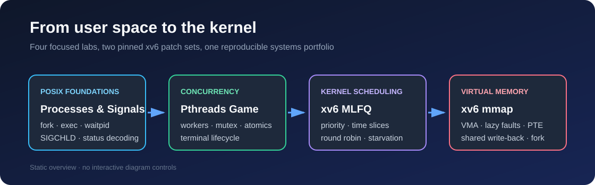

# Operating Systems Lab

A compact collection of operating-systems experiments spanning POSIX process
control, Pthreads synchronization, kernel scheduling, and virtual memory.
The two xv6 labs are distributed as small, reviewable patches against pinned
MIT upstream commits instead of duplicating complete xv6 source trees.



## Highlights

| Lab | Focus | Key implementation work |
| --- | --- | --- |
| [xv6 MLFQ scheduler](labs/03-xv6-mlfq-scheduler) | Kernel scheduling | Three priority queues, 3/6/12-tick time slices, round-robin selection, demotion and periodic priority boosts |
| [xv6 memory mapping](labs/04-xv6-memory-mapping) | Virtual memory | `mmap`/`munmap`, VMA tracking, lazy page faults, permissions, shared write-back and `fork` inheritance |
| [Pthreads terminal game](labs/02-pthreads-terminal-game) | Concurrency | Three worker threads, synchronized moving objects, deterministic seeds and terminal-state cleanup |
| [Processes and signals](labs/01-processes-and-signals) | POSIX systems programming | `fork`/`exec`/`waitpid`, signal-status decoding and a controlled `SIGSTOP`/`SIGCONT` lifecycle |

## Repository design

The xv6 directories contain authored patches, tests, documentation, and fixed
upstream identifiers. Run the preparation script to create a complete working
tree under the ignored `build/` directory:

```bash
./scripts/prepare-xv6.sh mlfq
./scripts/prepare-xv6.sh mmap
```

This keeps the repository focused on the changes being demonstrated and makes
the boundary between upstream xv6 and the extensions explicit.

## Quick start

The user-space programs require Linux or WSL with GCC/Clang, Make, and POSIX
threads:

```bash
make -C labs/01-processes-and-signals smoke-test
make -C labs/02-pthreads-terminal-game
./labs/02-pthreads-terminal-game/build/terminal-game --seed 3150
```

The xv6 labs additionally require a RISC-V GNU toolchain and
`qemu-system-riscv64`. After preparing a lab:

```bash
make -C build/xv6-mlfq
make -C build/xv6-mmap
```

See each lab's README for its run commands and test strategy.

## Verification status

- Both generated patches have been checked against their pinned upstream
  commits with `git apply --check`.
- User-space builds and xv6 builds are defined in
  [the CI workflow](.github/workflows/ci.yml).
- Runtime xv6 test evidence is recorded in
  [docs/verification.md](docs/verification.md); unverified results are marked
  explicitly rather than inferred from historic coursework screenshots.

## Demo

The Pthreads game has a short, original recording:
[watch `demo.mp4`](labs/02-pthreads-terminal-game/assets/demo.mp4).

## Scope and authorship

These are educational systems projects, not production kernel components.
All four implementations are individual work by Kaiwen Yao, cleaned and
documented after the course. Course handouts, grades, reports, student IDs,
third-party archives, toolchain binaries, and generated build artifacts are
intentionally excluded.

## License

Original user-space code, documentation, and xv6 extensions are released under
the [MIT License](LICENSE). Upstream xv6 attribution and the optional GPL kernel
module exception are documented in [NOTICE.md](NOTICE.md).

