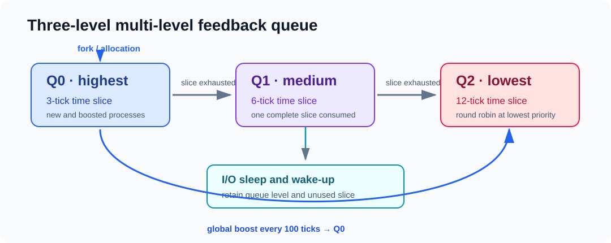

# xv6 multi-level feedback queue scheduler

This patch replaces xv6's table-scan scheduler with a three-level MLFQ while
preserving per-process locking and multicore scheduling.



## Policy

| Queue | Priority | Time slice | Exhaustion behavior |
| --- | --- | --- | --- |
| Q0 | Highest | 3 ticks | Demote to Q1 |
| Q1 | Medium | 6 ticks | Demote to Q2 |
| Q2 | Lowest | 12 ticks | Remain in Q2 |

New processes enter Q0. Sleeping processes retain their queue and unused time
slice. Every 100 ticks, runnable, running, and sleeping processes are promoted
to Q0 to bound starvation. Processes within one queue are selected in
round-robin order using an index rather than an unlocked process pointer.

Verbose scheduling messages are disabled by default. Build with
`XCFLAGS=-DMLFQ_DEBUG` when a trace is needed.

## Reproduce

From the repository root:

```bash
./scripts/prepare-xv6.sh mlfq
make -C build/xv6-mlfq
make -C build/xv6-mlfq qemu
```

At the xv6 shell:

```text
mlfqtest
mlfqtest stress
```

The patch targets `mit-pdos/xv6-riscv` commit
`e90b2575ae6efd40927fedb2425a1fc54ffa23df`.

