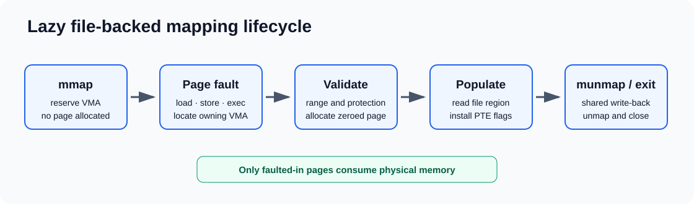

# xv6 lazy file-backed memory mapping

This patch adds a compact `mmap`/`munmap` implementation to the MIT xv6 mmap
lab baseline.



## Implementation

- Each process owns up to 16 virtual-memory areas (VMAs).
- `mmap` reserves an aligned range but does not allocate physical pages.
- Instruction, load, and store page faults validate VMA permissions, allocate
  one zeroed page, read the corresponding file region, and install a PTE.
- `MAP_SHARED` writable pages are written back when their range is unmapped or
  when the process exits.
- `fork` copies VMA metadata, holds file references, and copies only pages that
  were faulted in.
- `munmap` supports a complete VMA or a range at either edge, matching the
  teaching lab's simplified contract.

## Reproduce

```bash
./scripts/prepare-xv6.sh mmap
make -C build/xv6-mmap
make -C build/xv6-mmap qemu
```

At the xv6 shell, run `mmaptest`. The upstream grading command is:

```bash
make -C build/xv6-mmap grade
```

The patch targets the official `xv6-labs-2022` `mmap` branch commit
`9cc6b8345397c1f06cc93ed3fbaa20709cb1984e`.

## Deliberate scope

This educational implementation does not provide arbitrary fixed addresses,
middle-of-VMA splitting, page sharing between related processes, or a
production-quality dirty-page tracker.

